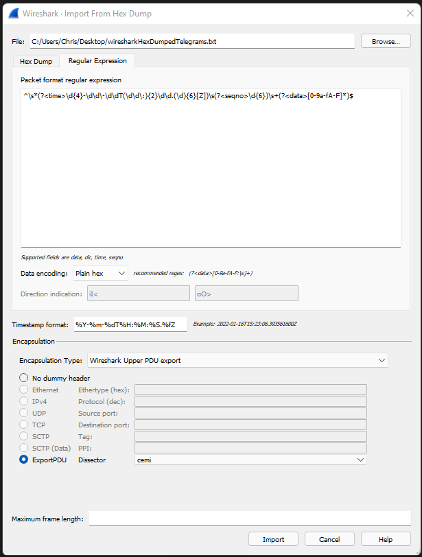
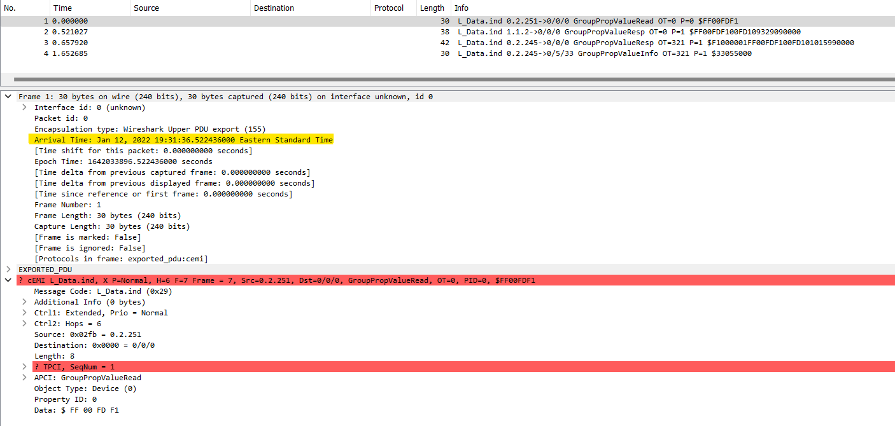
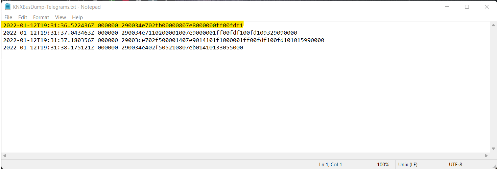
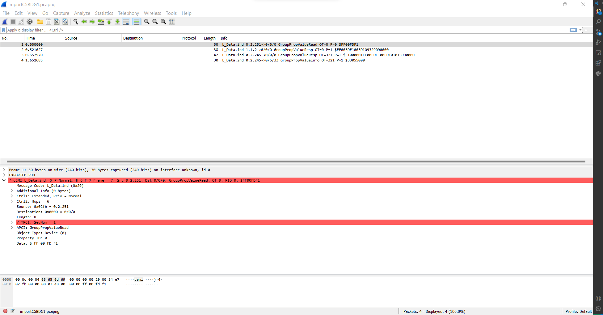

# KNX Bus Dump
KNX is a popular building automation protocol and is used to interconnect sensors, actuators and other components of a smart building together.  Our KNX Bus Dump tool uses the Calimero java library, which we contributed to for the sake of this tool, to record the telegrams sent over a KNX bus. Particularly, our tool accesses the KNX bus through a TPUART connection but can be changed to use different connection mediums. The telegrams are dumped into a Wireshark-compatible hex dump file. Timestamps are provided and normalized to UTC time with nanosecond precision to perform data analysis and provide a timeline of the telegrams. The hex dump file can be imported into Wireshark, which can be configured to dissect the KNX telegrams with Wireshark’s cEMI dissector. 

Tcpdump and Wireshark cannot be used to dump telegrams sent over a KNX bus since we are dealing with native KNX telegrams, not TCP/IP packets. Wireshark and tcpdump can dump KNXnet/IP packets, which are TCP/IP packets. KNXnet/IP is a protocol for sending commands and data to a KNX bus over a TCP/IP network.

Our tool can be used for protocol analysis of KNX sensors, actuators and other KNX devices. For example, we used the tool to understand our KNX devices and found irregular KNX telegrams. The tool is also ideal for security analysis of KNX devices given that it exposes all details of the involved protocol and data sent over the KNX bus.

# Prerequisites

This tool is designed to work with the Calimero Java library and is compatible with a Raspberry Pi 3 or 4 and a Raspberry Pi HAT for the TPUART connection.

Here are some guides to getting the environment setup:

  1. [KNX Raspberry PiHAT Usage Walkthrough](/KNX-Raspberry-Pi-Hat-Usage/README.md)
  2. [Raspberry Pi and Calimero Suite Setup](/Raspberry-Pi-Calimero-Setup/README.md)
  
_Note: The next steps will assume that you setup your environment according to these guides._

# Usage
  
  ## Creating the Hex Dump
  1. Place the _KNXBusDump.java_ file into the _introduction/src/main/java/_ folder of the Calimero Project suite.

  2. Change into the _introduction_ folder.

  3. To run the program, you can simply run:
      ```
      ./gradlew run -Pcalimero.serial.tpuart.maxInterByteDelay=60000 -Dmainclass=KNXBusDump
      ```
      
  4. Now, you wait for some messages to be transmitted on the bus and the dumped telegrams will be in the _KNXBusDump-Telegrams.txt_ file.

  5. Cancel the tool using Ctrl-C and the file is now ready to be imported into Wireshark to be analyzed.


  ## Analyzing the Hex Dump 
  In Wireshark, you have the ability to import packets from a hex dump and specify a dissector to analyze the packet.
  
  1. Upon starting Wireshark, wait for the initial loading to finish. Then click _File -> Import From Hex Dump..._
      
     
      
  2. In order to properly parse this out, we need to give it a regular expression (regex) with some tags.
    
      ```
      ^\s*(?<time>\d{4}-\d\d\-\d\dT(\d\d\:){2}\d\d.(\d){6}[Z])\s(?<seqno>\d{6})\s+(?<data>[0-9a-fA-F]*)$
      ```
  
  3. Choose the hex dump file as the source.
      
  4. Under the new dialog, change to the _Regular Expression_ tab and paste the regex into the box.
  
  5. Ensure that the data encoding is _Plain hex_
  
  6. In the _Timestamp format_ textbox, we need to specify the pattern that is generated by the tool. 
  
      ```
      %Y-%m-%dT%H:%M:%S.%fZ
      ```
      
      _**NOTE: The timestamp format MUST be the EXACT SAME as this. Otherwise, there will not be a timestamp parsed out.**_
      
  
  7. Under the _Encapsulation_ section, change _Encapsulation Type_ to _Wireshark Upper PDU Export_.
  
  8. Check _ExportPDU_ to specify the _cemi_ dissector.
  
  9. Now you're able to import the file and analyze the telegram.

     


# Sample Output


**Wireshark Timestamp:**
    
   

**Corresponding Hex Dump File**

   


**Note: The time that is highlighted is the NORMALIZED UTC TIME. No matter what the timezone next to the time says, it will ALWAYS be the right time in UTC.**


   

**Considerations:**
    
   1. The cemi dissector starts at the message code (MC) portion of the telegram. It does not take into consideration the medium type.
   2. The reason why the TPCI is highlighted in red is because of a design choice. The dissector will see that the packet is an Unnumbered Data Packet (UDP) which means that the sequence number, according to the KNX standard, is _usually_ set to 0. However, sometimes some devices will set this to a non-zero value. In this case, it was set to 1. The dissector will then check if the sequence number is zero. In this case it is not, thus the error message for the sequence number expecting to be 0. 


